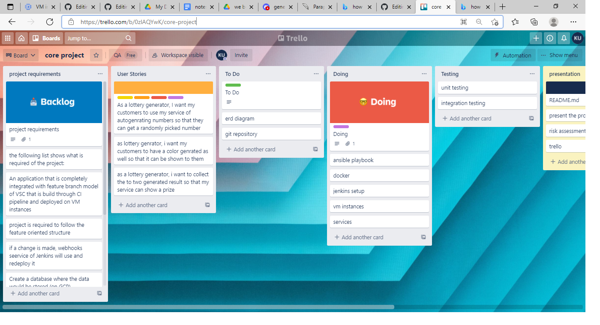
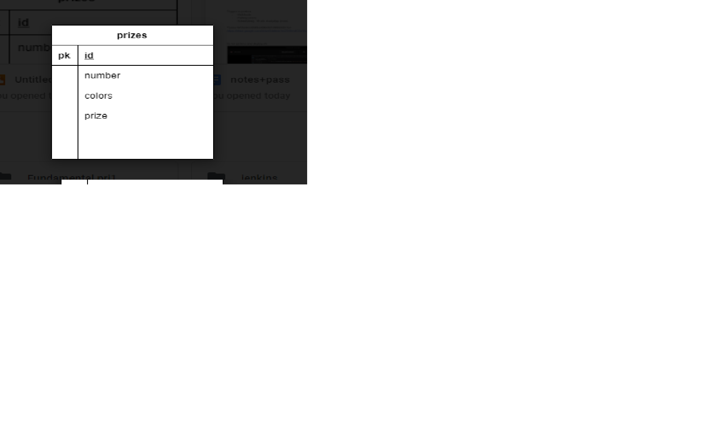
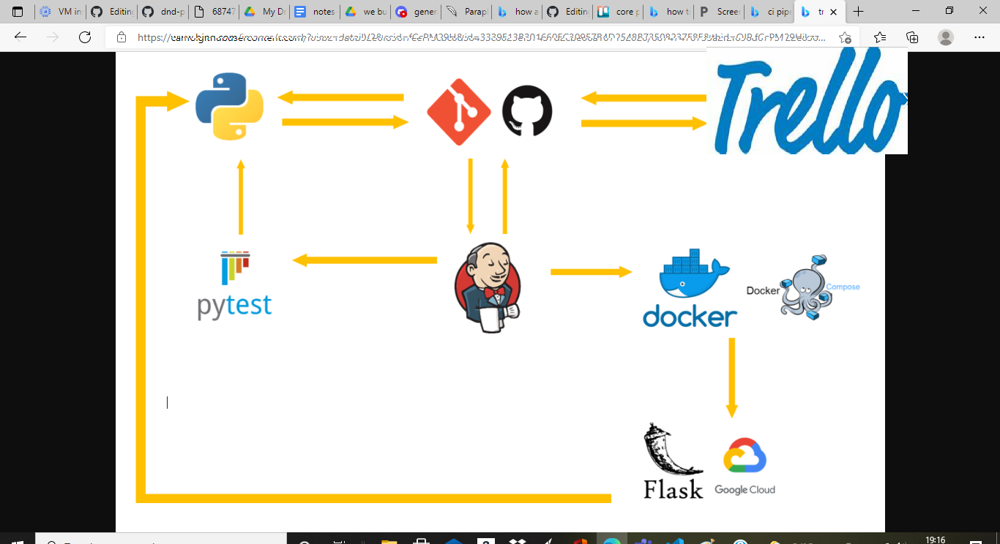
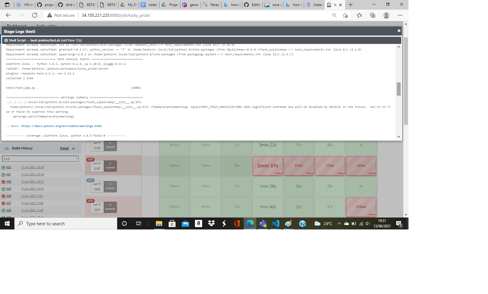

# project_2

<ul>
  <li>Project Objective</li>
<li>App Overview</li>
<li>Treello Board</li>
<li>Database</li>
<li>CI Pipeline</li>
<li>App Design</li>
  <li>Deployment</li>
<li>Testing</li>
  <li>Risk Assessment</li>
<li>Current Issues</li>
<li>Improvements</li>
</ul>

## Project Objective

The requirements of the project are as follows:
<ul>
<li>A TRello board (or similar Kanban board technology) with full task expansion to complete the project.</li>
<li>An application that is fully integrated into a Version Control System using the Feature-Branch architecture, then created using a Continuous Integration server and distributed to a cloud-based virtual machine..</li>
<li>If a change is made to a code base, then Webhooks should be used so that Jenkins recreates and redeploys the changed application.</li>
<li>The project must follow the Service-oriented architecture that has been asked for.</li>
<li>The project must be deployed using containerisation and an orchestration tool.</li>
<li>As part of the project, you need to create an Ansible Playbook that will provision the environment that your application needs to run.</li>
<li>To make your application accessible to the user, you'll need to employ a reverse proxy.</li>
</ul>

## App Overview
I created a DnD Prize generating app.As part of having two implementations, the first one is simpler than the first. here the fisrt app will call upon service 2,3,4. service 2 will bring a ramdom number service 3 will bring a colour and service will generate a prize with combination of service 2,3.

## Trello Board

I utilised an Trello board to keep track of my project and its development. The things required for the Minimum Viable Product are also listed on this board (MVP). This also includes finished user stories, which allow me to see what the user should be able to perform at the very least.

https://trello.com/b/0zlAQYwK/core-project

## Database

This application only requires a simple table to store information. Data is saved even after the application is brought down and back up via the use of a volume. The following table is used to store data:
database pic

## CI Pipeline  
This first diagram is what I initially imagined the CI Pipeline to look like. 
pic ci

Jenkins is a continuous integration and delivery pipeline technology. It starts a build when a new change is pushed to the version control system via a webhook. I utilised github as my version control system for my project, and Jenkins was connected to it via a webhook. Testing is the next step. To test every aspect of the application, unit tests and mock tests are written.If the testing section has returned back with no bugs, the next stage will kick off.After testing, the next step is to create images and publish them to Docker Hub (artefact repository). Jenkins will next run ansible, which will start the swarm manager and worker, as well as setup nginx. Ansible will also use a join token to connect the worker node to the manager node.Once, the swarm is initialised, the code is pulled from jenkins and any images required will be pulled from the artefact repository. Once the swarm is created and stack deployed to nginx the application is live now for the user.

##
risk assessment
below show the risk assessment for the risks faced in this project

##  App Design 1

The picture shows how it works. app one call upon other services. service 2 is showing numbers, service 3 is generating colours and service 4 is usign the results form service 2,3 to create a prize. it all randomly chosen for each case.

## Deployment
The app's deployment is automated and handled via Jenkins, Ansible, and Docker, among other tools. Jenkins will trigger a pipeline job through webhook after I commit to GitHub. My Jenkinsfile outlines the various steps of the pipeline. Each step refers to a script that handles a distinct stage of the pipeline to increase readability. Jenkins will start by inspecting the source code.Then run all my unit tests, and if they pass it will move on to the next stage.Jenkins will use Ansible to configure my computers in this step. Different roles are defined in my Ansible playbook, allowing me to instal different requirements based on what each machine will be accountable for. Ansible will instal Docker on each machine.

stage view is shown here
pic stage view

The above graphic depicts the project-build pipeline's logs, which illustrate the sequence in which each stage is implemented. The build logs make it easy to identify whether a stage has succeeded or failed. On Jenkins, the environment variables must first be specified as credentials.Credentials such as the database uri and the author need to be set in jenkins, in order for it to know what to refference when these variables are called upon.Furthermore, the advantage of using environment variables on jenkins is that they do not need to be altered once they are set. It's critical to keep credentials private.

## Testing 

As part of the project requirement, I also carried out unit testing on both implementations of my application.

Here you can see the coverage of my tests for each service.
pics 4 of them

## issues

<ul>
<li> machine ran out of space
<li> nginx is not configured
<ul>
  
## improvements

<ul>
<li>I could make the following enhancements in the future:
<li>To avoid downtime, include error handling.
<li>Keep stats in a database so that you have a complete character.
<li>Add a functionality that allows users to query the database at any moment to retrieve a character.
<li>Enhance your appearance
<ul>
  

